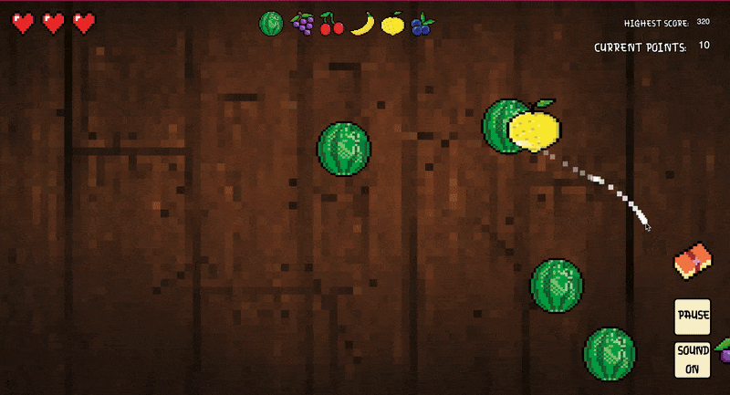

# 2025-group-20
2025 COMSM0166 group 20

## Your Game

Link to your game [PLAY HERE](https://uob-comsm0166.github.io/2025-group-20/)
git 

Your game lives in the [/docs](/docs) folder, and is published using Github pages to the link above.

Include a demo video of your game here (you don't have to wait until the end, you can insert a work in progress video)

## Your Group

- Omnia Ali, dc24201@bristol.ac.uk
- May Daoud, zy21368@bristol.ac.uk
- Barney Evershed, b.evershed.2021@bristol.ac.uk
- Scarlett Hurford, cy21903@bristol.ac.uk
- Matilda Stokes, jl21579@bristol.ac.uk
- Ziyan Zhao, rw24449@bristol.ac.uk

# Project Report

# Introduction

- 5% ~250 words 
- Describe your game, what is based on, what makes it novel?

- Smoothie Operator first came to inception as an accessible, lighthearted desktop or PC game. Simple to play, hard to get the hang of, creating a delicate balance, that appeals to both newer, more relaxed players, and the more eager, ambitious players. In essence, we wanted to capture the chaos and thrill, through the act of slicing fruit, taking inspiration from the popular tablet game "Fruit Ninja".

- Game Concept:
Fruit Ninja with a twist! Players take on the role of "knife" or "smoothie man" or "blender" (I don't really know if the player has a role sorry I just feel like those work thematically). Their task? To churn out Smoothie Recipes with precision and speed (I suppose it's not really speed but I just thought that would sound good). As they progress through the game, the fruits gets faster, the bombs get bigger (I know they don't yet but it's nice alliteration), the recipes get more bonkers and the pressue cranks up.
The "recipe system" (or the blender queue system as I like to call it), is specially designed to optimise players engagement, and the "recipe book" on hard mode gives the more advanced players a challenge. 

- Demographic and difficulty/accessibility:
We took a "the more the merrier" approach to our game demographic. The idea was to attract casual gamers, while also appealing to those looking for a challenge (more on this later, specifically when talking about our difficulty levels system). Similar to our inspiration Fruit Ninja, we wanted a "Pick up and play" or, with the tablet to desktop transition considered, the more accurately dubbed "Click on a play" design. It's an inviting, convenenient format 
Simplicity - one mouse or trackpad control
Playing sessions should be compact, digestible, but replayable 
 
- USPs (Unique Selling Point - what makes our game different?):
Fruit Ninja - with a twist! Specific slicing patterns delegated to specific fruits, as well as specific "recipes" you have to follow, adds a memory/skill-mastering aspect to the game that encourages a more engaging gameplay. 
Technologies and technological difficulties

- Player Experience (the learning curve, engagement over time etc.) and progression:
Instant gratification and satisfaction(how satisfying it is when you slice a fruit i.e. animations, graphics and sound)
Player immersion - No timer, immersive visuals etc.

- Summary of the overall vision 

# Requirements (Ziyan)
.
- 15% ~750 words
- Use case diagrams, user stories. Early stages design. Ideation process. How did you decide as a team what to develop? 

We've actually already written all of this! Will find a way of structuring it more succinctly at some point in this section :)
# Design (Barney)

- 15% ~750 words 
- System architecture. Class diagrams, behavioural diagrams.

Our design elements had a focus on maintability and Object-Oriented Principles, in order to create a robust foundation for the game. 

- System Architecture
- This section should include our User Interface (How the user interacts with the game both visually and gesturally - ie. the mouse or trackpad sliding to simulate the slicing of the fruit), the Game Logic (the fruit generation, the mechanics behind the slicing patterns, the scoring, and the registering of incorrect slicing adnd slicing bombs) and the Data Management (Persistently tracking game state and player statistics) - let me know if I've missed anything!
- This displays a modular approach to seperating the code, which instigates efficient testing and feature addition.

- Object-Oriented Design 
- Object-Oriented Design should display clarity and flexibility: Encapsulation, Abstraction, Inheritance, Polymorphism, Composition)

- Class Diagrams
- Explanation of our different classes, their different roles and relationships in accordance with the game and Object-Oriented Principles
- So far looking at the code we have the: Fruit Class, Life Icons Class, Point System Class, Slice Pattern Class, Smoothie Recipe Class
- These classes establish the relationships and associations clearly so the interactions within code are cohesive and gameplay retains data integrity

- Behavioural Diagrams
- We need to include sequence diagrams here like in the pac-man slides (demonstrate the dynamics of the gameplay) I don't want to use this but I've made a simplified one below to show you what it could look like
Player → Cursor: slice action cursorEffect()
Cursor → Fruit: isSliced() (in SlicePattern class)
Fruit → Fruit: isHit() (in HitBox class)
Fruit → Game: correctCut || recipeComplete() (in PointSystem class)
Game → Game (only if the highest score is reached): updateHighestScore(gameScore) (in HighestPointDisplay class)
Game → UI: gameScreen() (should update the display as necessary)

- Design Decisions and Subsquent Justification
- In designing our game we decided to use p5.js - it is easy to learn and easy to use, with good HTML/CSS/JAVASCRIPT integration as well was being really adaptable and easy to use in any modern browser. 

# Implementation (Omnia)

- 15% ~750 words

- Describe implementation of your game, in particular highlighting the three areas of challenge in developing your game. 

# Evaluation (Matilda)

## Abstract

This section presents the HCI evaluations of Smoothie Operator, with a particular focus on assessing balanced usability, cognitive load, and player engagement. To assess the game's key issues early in the design process, we employed a mixed-methods approach - combining qualitative feedback from Think Aloud evaluations with quantitative data collected using the NASA Task Load Index (TLX). Evaluations were conducted with a range of participants to encapsulate a comprehensive picture of potential user behaviours and perceptions. The primary objectives were to identify the usability key issues and measure player workload and demand across gameplay tasks to inform iterative design improvements. Results from the evaluations provided clear and direct feedback on the game's task flow and cognitive demands, leading to straightforward problem-solving to gameplay.

## Qualitative: Think Aloud

To evaluate the usability and HCI design of Smoothie Operator, we employed the Think Aloud (TA) protocol—an established method that provides real-time insights into user behaviour and experience (Nielsen, 1993). This approach was selected over Heuristic Evaluation for several reasons: the dynamic nature of the gameplay—requiring rapid mouse-based gestures and immediate feedback—demanded direct observation of users in context. Heuristic methods are less effective in capturing real-time breakdowns in game interaction, particularly when evaluating unconventional input modalities. TA enables the collection of instantaneous verbal data from participants as they engage with the game. This revealed four prominent areas for improvement: confusion around input mapping, varied responses to the visual feedback system, the learning curve associated with recipe memorisation, and the overall emotional experience. The richness of these observations, particularly in relation to control fluency and gameplay clarity, significantly informed subsequent design iterations. Participant commentary was analysed using thematic coding and categorised to identify patterns of friction, satisfaction, and emergent player strategies (see Table X). 

Table X: Raw Think Aloud (TA) feedback
| Theme           | Positive                                                                                                                                 | Negative                                                                                                                            |
|----------------|------------------------------------------------------------------------------------------------------------------------------------------|-------------------------------------------------------------------------------------------------------------------------------------|
| Controls        | - The click control is very satisfying - The `cursorEffect` provides good user feedback                                              | - Touchpad is inelegant - The `mousepressed` function bugs after hearts lost - The `mousepressed` for slicing could be redundant |
| Display         | - Good fruit sizes - Fruit slice visuals are very rewarding                                                                          | - Recipe aspect and order is unclear - `cursorEffect` does not remain long enough - Some fruits are generated stuck together   |
| Learning Curve  | *(None listed)*                                                                                                                         | - Initial difficulty remembering rules - Initial difficulty remembering slice patterns - Once slice patterns are internalised, they're too easy to remember |

### Controls 
Feedback regarding the game’s controls was fairly consistent. There was a general consensus that adapting a game typically played on a touchscreen device (such as an iPad or phone) to a laptop or PC using a mouse or trackpad introduced a degree of disjointedness to the user experience. Our user tests were structured so that roughly a third of participants played using a mouse, a third with a trackpad, and a third tried both sequentially. The overall consensus was that using a mouse provided a more fluid and enjoyable gameplay experience.

A minor bug was encountered — labelled in our test documentation as "the mousePressed function bugs after hearts lost" — but this was resolved early in development.

One tester suggested that the "click and drag" mechanic for slicing might be redundant, and that gameplay might be smoother if users didn’t need to press down at all. While we carefully considered this feedback, we ultimately chose not to act on it for the following reasons:

1. The blueberry’s "slice pattern" requires a single-click input, which would become unworkable without click detection.
2. In easy mode, testers highlighted the satisfying, rapid clicking mechanic as a key positive feature.
3. Removing the click would reduce user control, increasing the likelihood of accidental slices — especially problematic when users may be trying to pause the game or consult the recipe book.

### Display
NEED TO ACTUALLY FIX SOME THINGS IN THE GAME - 1. CURSOREFFECT DOES NOT REMAIN FOR LONG ENOUGH 2. RECIPE ASPECT ORDER UNCLEAR 3. FRUIT GENERATED STUCK TOGETHER

### Learning Curve
Early user feedback regarding the game's initial difficulty was flagged: at this stage in the development several core features hadn't been implemented. Users found the games objectives and rules were initially unclear and many disliked the reliance on memory; having to remember specific slice patterns was tedious and created a slow, tedious gameplay. 

To address this, we implemented two features to our gameplay:

1. The recipe book: In hard mode, we introduced an in-game recipe book, that displays slice patterns for fruit. This allowed the user to easily refer to it during gameplay, eradicating any clunky, stop-and-start flow from having to memorise them.

*Figure 1: Demo of the interactive recipe book feature.*

2. Tutorial Mode: We also added a tutorial accessible directing from the start screen. This faciliatated users to practise before gameplay. The player could internalise the slicing mechanics, and learn other essential gamplay features, such as:
 - Avoiding the bomb
 - The dragonfruit +1 life benefit
 - The importance of slicing the fruit in the correct recipe order

*Import gif when tutorial complete*

## Quantitative: NASA TLX
One of our primary goals was to create a game that was accessible to both casual players and highly-skilled users. As a result we devised two levels of difficulty within our game. We wanted a noticable increase in difficulty between the modes (this has been proven to increase player enjoyment from previous studies (Alexander et al., 2013)), while having frustration levels remain relatively unchanged. In Easy Mode, the user still needed to slice the fruit in the correct recipe order, but the slice patterns and the bombs were scrapped. In Hard Mode, the bombs and the slice patterns were re-introduced. We collected a data using the NASA Task Load Index (TLX) from a group of diverse age ranges, and with differing experience in playing video games. We chose the NASA TLX as it's been shown to be highly reliable for assessing game difficulty (Hart & Staveland, 1988; Ramkumar et al., 2016; Seyderhelm & Blackmore, 2023). We determined that using the raw TLX scores would be easier and faster to administer, and that it makes sense to opt for the easier option when studies report back mixed results for raw vs. weighted TLX scores (Hart (2006)).

*Figure 2: NASA TLX Evaluation Bar Chart Feedback.*

The bar chart above shows a notable increase in overall workload from Easy to Hard mode: an expected and desirable outcome. These results validated our game objectives- we wanted to create an engaging learning curve to interest first-time players and long-term gamers.

- The accompanying pentagraph (below) reveals more granular differences:
- A significant rise in effort and frustration
- A moderate increase in mental demand and perceived performance
- Minimal change in physical or temporal demand

These findings suggest that the added difficulty in Hard mode effectively challenged the player without overwhelming them physically or pacing-wise.

*Figure 3: NASA TLX Pentagraph demonstrating specific demand difference feedback.*

The accompanying pentagraph (above) reveals more granular differences:
- A significant increase in effort and frustration
- A moderate increase in mental demand and perceived performance
- Minimal or no change in physical or temporal demand

These findings suggest that the added difficulty in Hard mode effectively challenged the player without overwhelming them physically or pacing-wise.

# Process (May)

- 15% ~750 words

- Teamwork. How did you work together, what tools did you use. Did you have team roles? Reflection on how you worked together.

# Sustainability (Scarlett)
- 10% ~750 words
- Evidence of the impact of your game across the environment and two of the other areas:
- Environmental + 2 of the following: social, economic, technical, individual

# Conclusion

- 10% ~500 words

- Reflect on project as a whole. Lessons learned. Reflect on challenges. Future work. 

### Contribution Statement

- Provide a table of everyone's contribution, which may be used to weight individual grades. We expect that the contribution will be split evenly across team-members in most cases. Let us know as soon as possible if there are any issues with teamwork as soon as they are apparent. 

### Additional Marks

You can delete this section in your own repo, it's just here for information. in addition to the marks above, we will be marking you on the following two points:

- **Quality** of report writing, presentation, use of figures and visual material (5%) 
  - Please write in a clear concise manner suitable for an interested layperson. Write as if this repo was publicly available.

- **Documentation** of code (5%)

  - Is your repo clearly organised? 
  - Is code well commented throughout?
