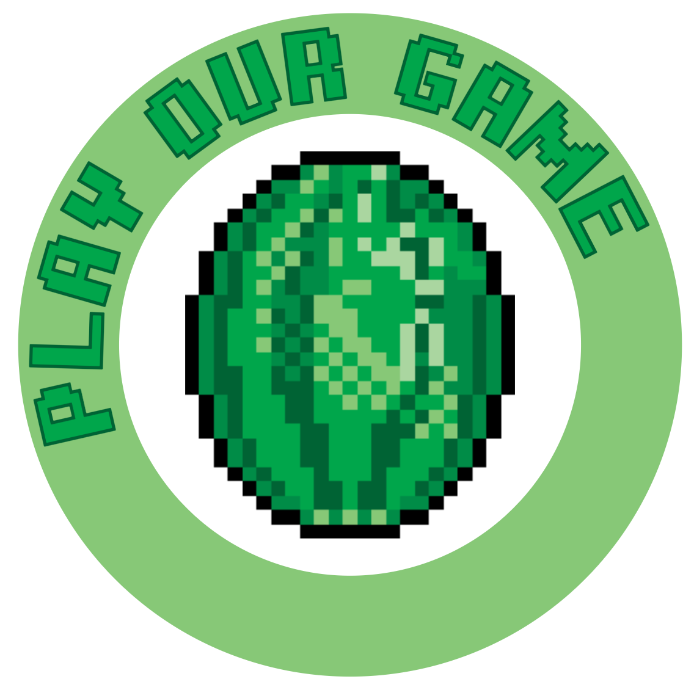

# 2025-group-20
2025 COMSM0166 group 20

## Our Game

 
   
  
  
  

## Our Group

  

# Introduction
When designing our game, we wanted to create something that paid homage to a game we all knew and loved growing up, but with a twist that makes it more mentally engaging. Rather than relying solely on instinct and quick reactions, we aimed to challenge players’ focus, precision, and sequencing skills. We also wanted to create a game that offers players a fun and rewarding experience whether they were new or advanced gamers. This idea led to the creation of Smoothie Operator—a slicing game that emphasizes accuracy and mental focus! 

We drew inspiration from two food-based games: Fruit Ninja, a fast-paced, endless slicer that tests reflexes but doesn’t engage the brain deeply, and Overcooked, a kitchen simulation that emphasizes completing tasks in a specific sequence but lacks pacing. From these two, we created a hybrid experience with two twists. First, players in ‘ninja’ mode slice fruits not just for fun, but to complete smoothie recipes in the order displayed at the top of the screen. Second, in Samurai mode, the challenge increases—players still need to follow the recipe order, but they must also slice fruits in specific directions, adding another layer of difficulty. This dual-mode approach makes the game both engaging and rewarding, supporting progression. 

To further improve engagement, Smoothie Operator also includes a multiplayer mode that encourages teamwork. One player uses the mouse to slice fruits, while the other controls a basket with the keyboard to catch them. This cooperative play meant that our game could create communication and social interactions. We made sure to design our game based on the user experience, which led to us creating a game that was both mentally and physically engaging, has pace and simple to understand.

# Requirements 

<h3>Ideation Process</h3>

  In the early stages of development, we used both 
  <a href="https://miro.com/app/board/uXjVLtyUR80=/Miro" target="_blank">Miro</a> (Figure 1) and 
  <a href="https://uob-my.sharepoint.com/:w:/r/personal/zy21368_bristol_ac_uk/_layouts/15/Doc.aspx?sourcedoc=%7B16215be5-ecc8-4461-980c-cd596f6d788d%7D&action=edit&wdPid=4e6e8707" target="_blank">Google Docs</a> 
  to collaboratively brainstorm and explore different game concepts. After multiple discussions, we narrowed our ideas down to three main options:

<ol>
  <li><b>University Life Simulation</b></li>
  <li><b>Fashion-Combat Game</b></li>
  <li><b>Fruit Ninja with Recipes</b></li>
</ol>

   
  <b>Figure 1. </b> <i>Miro Board</i>

  During the third workshop, we created a paper prototype to help refine our ideas. This hands-on approach allowed us to translate abstract concepts into tangible gameplay mechanics. By interacting with paper props, we were able to explore key aspects such as visual layout, control schemes, and optimal user interaction.

  Following this exercise, we held a team vote and ultimately chose to develop a game inspired by <i>Fruit Ninja</i> with a slight adaptation from another game, <i>Overcooked</i>. We felt this concept offered a manageable scope for development while still providing creative flexibility to tailor the user experience. In particular, we were drawn to the idea of blending two game genres: mentally engaging mechanics with a casual arcade game.

  
   
  <b>Figure 2. </b> <i>Ninja Fruit</i> &nbsp;&nbsp;&nbsp;&nbsp;
  <b>Figure 3. </b> <i>Overcooked</i>

   
  <b>Figure 4. </b> <i>Paper Prototype</i>

<h2>Identifying Stakeholders</h2>
We first developed an Onion Model to identify key stakeholders to help us understand the different perspectives that influence game design, including players, developers, and testers. We then sought feedback during the prototype demonstrations, asking individuals to evaluate the game both as stakeholders and as players. Although our project is primarily designed in a university setting, the Onion Model underscores the capacity of successful systems to shape broader social behaviours by providing engaging gameplay experiences tailored to relevant communities. 

   
  <b>Figure 5. </b> <i>Onion Model of Smoothie Operator</i>

<h3>User Stories</h3>

We used user stories to define our functional requirements because they provide a clear, stakeholder-centred way to communicate what to build, for whom, and why—making them accessible to both technical and non-technical team members. We began by identifying a broader strategic objective (initiative), then broke it down into epics and further into user stories. This structured approach was especially helpful in the early stages of game development, as it gave us a focused and actionable goals as to what to build. For example, we designed the game to have a tutorial page from the start, so our game maintains clarity. 

| Initiatives                  | Epics                                           | User Stories |
|-----------------------------|--------------------------------------------------|--------------|
| Simple Gameplay and Clarity | Clear visual design and self-explanatory mechanics | - As a busy player with daily commitments, I want a game that is easily accessible and simple to follow, so I can play in brief sessions without feeling overwhelmed. - As a casual player, I want a game with straightforward and intuitive gameplay that I can pick up quickly without a time-consuming learning curve. - As a new player, I want the game to provide immediate feedback and clear instructions, so I can understand how to play and improve without needing external help. |
| Simple Gameplay and Clarity | Simple mouse movements                          | - As a casual player, I want to slice objects using quick mouse movements, so I can enjoy fast-paced gameplay without complicated controls. - As a regular player, I want the game to recognise my slicing directions accurately through mouse movements, so that I can feel in control and engaged from the start. |
| Progression of Difficulty   | As game goes on for longer recipes get more complex | - As a regular player, I want the game to introduce faster objects over time, so that the game challenge increases and keeps me engaged. - As a competitive player, I want the game to introduce more variety like combo traps, so I feel rewarded for improving my skills. |
| Progression of Difficulty   | As game goes on slicing patterns get more complex | - As a focused player, I want slicing patterns to require specific directions as the game goes on, so I can feel a growing sense of improvement and precision. - As a strategic player, I want the game pace to accelerate in pace, so I can find it more challenging to slice a fruit correctly and precisely. |
| Sense of Achievement        | Player has their high score kept track of        | - As a competitive player, I want the game to record my highest score, so I can try to beat my personal best each time I play. - As a motivated player, I want to see my high score displayed on the main menu, so I feel encouraged to keep improving and playing again. - As a returning player, I want the game to display a history of my best scores, so I can stay motivated and see how much I’ve improved. |
| Sense of Achievement        | Player loses lives if they do something wrong    | - As a new player, I want a clear visual when I make a slicing mistake that costs a life, so I can learn from my errors and improve without confusion. - As a challenge-seeking player, I want to lose a life if I slice a forbidden object (i.e. bomb), so the game feels more intense and still requires precise decisions under pressure. |

Table 1: <i>User requirements divided into initiatives, epics, and user stories.</i>

<h3>Use Case Diagram and Specifications </h3>

At this stage of development, we were still evaluating whether our game concept was feasible to implement and enjoyable to play. To better understand the functionality and expectations of different stakeholders, we used user stories and identified key roles to create a Use Case Diagram (Figure 5). This helped us visualise and define what different elements of the game should—and shouldn’t—do. 

   
  <b>Figure 5. </b> <i>Use Case Diagram</i>

In addition to the diagram, we developed detailed use case specifications to map out how players would interact with the game. This proved incredibly helpful, as it made us realize the importance of providing clear feedback and visibility within gameplay. For instance, players should be notified not only when they make a mistake but also when they achieve something. Including such feedback mechanisms became a core design priority to enhance user clarity. 

As we worked through these use cases, we also saw an opportunity to introduce a multiplayer mode to encourage social interaction. As a result, we expanded our use case specifications to cover both single-player and multiplayer scenarios, ensuring each mode supported our overall gameplay goals and user experience. 

    
## Use Case Specification
### 1.Single Player Mode
**1.1 Basic Flow**

| **Step** | **Easy Mode**                                                                                      | **Hard Mode**                                                                                           |
|---------:|----------------------------------------------------------------------------------------------------|----------------------------------------------------------------------------------------------------------|
| 1        | Player launches the game and selects Easy mode.                                                    | Player launches the game and selects Hard mode.                                                          |
| 2        | Recipe icons appear at the top of the screen.                                                      | Recipe icons appear at the top + slicing methods found in recipe book (bottom-right corner).            |
| 3        | Fruits appear and can be sliced freely using a mouse.                                                            | Fruits appear and must be sliced in the correct direction/method using a mouse.                                       |
| 4        | Slice any correct fruit: +10 points.                                                               | Slice correct fruit **with correct method**: +10 points.                                                 |
| 5        | Complete a recipe (all fruits in the recipe are sliced): +20 bonus points.                                     | Complete a recipe with correct slices: +20 bonus points. 

<b>Table 2a. </b> <i>Use Case Specification of Basic Flow in Single Player.</i>
                                
**1.2 Alternative Flow**

| **Step** | **Easy Mode**                                                   | **Hard Mode**                                                        |
|---------:|------------------------------------------------------------------|----------------------------------------------------------------------|
| 1        | Wrong fruit sliced: -1 heart. No effect on score.               | Wrong fruit sliced: Same as Easy mode.                 |
| 2        | Sliced dragon fruit: +1 heart (max 3).                          | Sliced dragon fruit: +1 heart (max 3).                            |
| 3        | Sliced bomb: Instant game over.                                 |  Sliced bomb: Instant game over.                                    |
| 4        | Incorrect slicing method: Not applicable.                       | Incorrect slicing method: -1 heart. No score.                       |

<b>Table 2b. </b> <i>Use Case Specification of Alternative Flow in Single Player.</i>

### 2. Multiple Player Mode

#### 2.1 Basic Flow

| **Step** | **Easy Mode**                                                                                                 | **Hard Mode**                                                                                                  |
|---------:|---------------------------------------------------------------------------------------------------------------|-----------------------------------------------------------------------------------------------------------------|
| 1        | Player 1 selects Easy + Two Player mode.                                                                      | Player 1 selects Hard + Two Player mode.                                                                       |
| 2        | Player 1 slices fruits using the mouse.                                                                       | Player 1 slices fruits using correct direction/method.                                                         |
| 3        | Player 2 moves basket using ⬅️ and ➡️ arrow keys to catch sliced fruit.                                        | Same as Easy mode.                                                                                             |
| 4        | Correct sliced fruit caught: +10 points.                                                                      | Correctly sliced **and** caught fruit: +10 points.                                                             |
| 5        | Recipe completion: +20 bonus points.                                                                          | Same, only if all fruits sliced correctly and caught.                                                          |

<b>Table 3a. </b> <i>Use Case Specification of Basic Flow in Multiple Player.</i>

#### 2.2 Alternative Flow

| **Step** | **Easy Mode**                                                   | **Hard Mode**                                                        |
|---------:|------------------------------------------------------------------|----------------------------------------------------------------------|
| 1        | Fruit missed by basket: No points awarded.                      | Fruit missed by basket: No points awarded.                          |
| 2        | Wrong fruit sliced: -1 heart.                                   | Wrong fruit sliced: -1 heart.                                       |
| 3        | Sliced dragon fruit: +1 heart (max 3).                          | Sliced dragon fruit: +1 heart (max 3).                             |
| 4        | Bomb sliced: Instant game over for both players.               | Bomb sliced: Instant game over for both players.                    |
| 5        | Incorrect slicing method: Not applicable.                       | Incorrect slicing method: -1 heart. No score.                       |

<b>Table 3b. </b> <i>Use Case Specification of Alternative Flow in Multiple Player.</i>

# Design 

We chose an Object-Oriented Design as it made visualising and designing the game easier as well as providing additional benefits of code efficiency and modularity, making it easier to maintain and scale up in the long run. This meant upholding the principles of Object-Orientation including encapsulation, abstraction, inheritance, polymorphism and composition. 

With these principles in mind, we devised the classes represented in the class diagram below: 

Within the diagram we have omitted constructors, getters and setters as well as any attributes that are constant for simplicity and ease of reading. It centres around the GameManager class which organises and utilises the other objects to produce the gameplay loop. This class is also extended by the TutorialManager class to provide slightly different functionality for the tutorial. These classes get rum through the Sketch.js file which utilises the P5 library functions to act as a “main” file. The user interacts with this file and the objects within it through a system of on-screen buttons to navigate with the settings and between the different states as well as through use of the mouse and the left and right arrow keys or the “a” and “d” keys during gameplay to slice the fruit or move the basket in two player mode respectively. The aim was to make navigation and interaction with the system easy and intuitive to uphold Nielson’s usability principles.

The way in which these classes communicate and interact whilst the user interacts with the system is detailed in the Sequence Diagram below: 

Yet again we have omitted constructors, getters and setters that aren’t absolutely necessary to display the communication as well as functions/messages that have minor functionality within the context of the function they are being called in for simplicity and ease of reading.

# Implementation

## Challenge 1: A suitable hitbox mechanism
Smoothie Operator is based on Fruit Ninja, which was developed for mobile devices, allowing players to smoothly swipe the fruits on their touchscreens in any direction. Our easy mode, which only requires the player to follow a specified smoothie recipe, followed that pattern and its implementation was straightforward. However, our hard mode introduces a further twist which involves crafting a unique slicing mechanism for each fruit. Our first challenge was to design an intuitive slicing mechanism that works seamlessly with computer mice and trackpads. 

Our initial approach was to generate 3 invisible circular hitboxes on each fruit that followed the direction of the designated slicing pattern and moved with the fruit on the screen. If the cursor touches all three hitboxes in the correct order, a correct slice will be registered, and the user will move to the next fruit in the recipe. Otherwise, the user will be informed of the wrong slice, and they will try slicing the same fruit again. However, during the early evaluation stages of our game, users reported that the design required highly accurate swipes which were difficult to achieve while the fruit was moving across the screen. This first implementation was flawed because the hitboxes did not cover the entire fruit and even a slight misalignment would cause an objectively correct slice to go unregistered. This not only caused frustration for our users, but for us as well because we wanted our game to be stimulating yet enjoyable. 

Upon examination, we decided to extend the hitboxes to represent a 3x3 grid that covered the entire fruit. This meant that a correct slice can be registered if the user aimed for the edges of the fruit. However, the cursor still needed to hit 3 consecutive hitboxes in the same row/column. Users again reported that it was difficult to keep the cursor in a straight line if the fruit was moving along the screen. This impacted our users' experiences because the system was still registering objectively correct slices as false negatives. Even after adjusting the fruits' speed, or allowing the hitboxes to overlap, we were still encountering difficulties with this design and so we brainstormed one last time. 

In our final implementation, we maintained the 3x3 grid of hitboxes, but we changed the threshold for a correct slice. A more lenient approach required the cursor to hit the first two hitboxes in the same row/column. After that, if the cursor hits any of the boxes in the remaining row/column, a correct slice will be registered. This makes up for the stress of following the fruit along the screen with a mouse or a trackpad while maintaining the challenging yet exciting aspect of following a specific slicing pattern 

   
  <b>Figure . </b> <i>Evolution of the hitbox system. Arrows indicate valid directions that count as a correct slice.</i>

## Challenge 2: UI Optimisation

After implementing most of the game features, we noticed performance issues regarding the loading phase and fruit spawn timing. Through testing, we traced these issues to an overreliance on JavaScript for managing the game’s UI layout and screen transitions. 
Our initial codebase mainly used JavaScript to manage button placement and interactions across multiple screens, including the difficulty mode selection, recipe, start, pause and tutorial screen. Clicking a button would often trigger several JavaScript functions and DOM manipulations, which introduced noticeable delays and complications. 
We were able to use CSS and handle these tasks and their layout more efficiently. We shifted layout responsibilities to CSS using Flexbox, where certain segments oversaw different button layouts for example, i.e. centre-buttons (horizontal),. button-wrapper (vertical) and. horizontal. This simplified alignment and spacing without relying on JS positioning logic. We also found an opportunity to add even more visual feedback, including hover effects, a flash effect when user does not click on an option and titles, reducing the need for additional event listeners or styles toggles in JS. We transformed, what previously was a scattered style logic, into a single CSS file. This organised classes such as .button and .imageButton for reuse across different game screens and button types. Additionally, we used a custom font with @font-face to ensure stylistic consistency without additional JS font loading. 
This CSS-first approach greatly improved UI responsiveness, reduced code duplication, and made the layout far easier to manage and understand. It also freed up JS to focus solely on gameplay logic, such as scoring, fruit behaviour, and player interaction. 

# Evaluation 
## Qualitative: Think Aloud

To evaluate the usability and HCI design of Smoothie Operator, we employed the Think Aloud (TA) protocol—an established method that provides real-time insights into user behaviour and experience. This approach was selected over Heuristic Evaluation for several reasons: the dynamic nature of the gameplay—requiring rapid mouse-based gestures and immediate feedback-demanded direct observation of users in context. Heuristic methods are less effective in capturing real-time breakdowns in game interaction, particularly when evaluating unconventional input modalities. TA enables the collection of instantaneous verbal data from participants as they engage with the game. This revealed three prominent areas for improvement: confusion around input mapping, varied responses to the visual feedback system and the learning curve associated with recipe memorisation. The direct nature of these observations, particularly in relation to control fluency and gameplay clarity, significantly informed subsequent design iterations. Participant commentary was analysed using thematic categorisation that identified patterns of friction, satisfaction, and emergent player strategies (see Table 4a). 

| Theme           | Positive                                                                                                                                 | Negative                                                                                                                            |
|----------------|------------------------------------------------------------------------------------------------------------------------------------------|-------------------------------------------------------------------------------------------------------------------------------------|
| Controls        | - The click control is very satisfying - The `cursorEffect` provides good user feedback                                              | - Trackpad is inelegant - The `mousepressed` function bugs after hearts lost - The `mousepressed` for slicing could be redundant |
| Display         | - Good fruit sizes - Fruit slice visuals are very rewarding                                                                          | - Recipe aspect and order is unclear - `cursorEffect` does not remain long enough - Some fruits are generated stuck together   |
| Learning Curve  | *(None listed)*                                                                                                                         | - Initial difficulty remembering rules - Initial difficulty remembering slice patterns - Once slice patterns are internalised, they're too easy to remember |

**Table 2a**: *Raw Think Aloud (TA) feedback*

## Controls 
We found that adapting a game designed for touchscreens to laptop or PC input introduced some disjointedness. Our testing split participants evenly between mouse, trackpad, and both. The majority found the mouse offered a smoother, more enjoyable experience. 

One participant suggested removing the "click and drag" mechanic to simplify slicing. We considered this but decided against it for key reasons: 

1. The blueberry’s slice pattern relies on single-click input, which wouldn’t work without click detection. 

2. In easy mode, rapid clicking was seen as a satisfying feature. 

3. Removing click control could lead to accidental slices, especially when accessing menus or the recipe book. 

## Display 
User feedback on visuals was exceptionally positive. Players appreciated the nostalgic 8-bit style, satisfying fruit slicing, and the responsive, engaging cursor. The visual design was seen as cohesive and well-executed. 

However, two recurrent issues emerged. First, the occasional generation of overlapping rendered fruits difficult to slice, which we resolved by adjusting spawn rate and speed. Second, some users had trouble seeing their slicing direction and requested a longer-lasting cursor. To avoid clutter, we introduced the cursorWoodScratch effect—a subtle trail beneath the cursor and fruit—preserving clarity while enhancing feedback. 

  
   
  <b>Figure 9. </b><i>`cursorWoodScratch` implementation.</i>

## Learning Curve
Early user feedback highlighted issues with the game's initial difficulty. At that stage, several game core features haven’t been implemented, and players found the objectives unclear. Many also disliked the reliance on memory—having to recall specific slice patterns made gameplay feel slow and repetitive. To address this, we implemented two key features: 

Recipe Book (Figure 4b): In hard mode, we added an in-game recipe book displaying fruit slice patterns. This allowed players to refer to it during gameplay, removing the need for memorisation and improving flow. 

Tutorial Mode (Figure 4c): Accessible from the start screen to let users practise core mechanics before playing. It introduces essential elements such as: 

1. Avoiding bombs 

2. The dragon fruit’s +1 life bonus 

3. The importance of slicing fruit in the correct recipe order

  

    
     
    <b>Figure 10. </b> <i>Dragonfruit feature in tutorial mode.</i>
  

   
  

    
     
    <b>Figure 11. </b> <i>Demo of the interactive recipe book feature.</i>
  

## Quantitative: NASA TLX
One of our primary goals was to design a game that was accessible to both casual and experienced users. As a result, we devised two levels of difficulty within our game. We aimed for a noticeable increase in challenge between modes, as research shows this boosts player enjoyment (Alexander et al., 2013) but without significantly increasing frustration. In Easy Mode, the user still needed to slice the fruit in the correct recipe order, but the slice patterns and the bombs were scrapped. In Hard Mode, the bombs and the slice patterns were re-introduced.  

We collected data using the NASA Task Load Index (TLX) from a group of diverse age ranges, and with differing experience in playing video games. We chose the NASA TLX as it's been shown to be highly reliable for assessing game difficulty (Hart & Staveland, 1988; Ramkumar et al., 2016; Seyderhelm & Blackmore, 2023). We determined that using the raw TLX scores would be easier and faster to administer, and studies reported back mixed results for raw vs. weighted TLX scores (Hart (2006)). 

   
  <b>Figure 12. </b> <i>NASA TLX Evaluation Bar Chart Feedback.</i>  

The bar chart above shows a notable increase in overall workload from Easy to Hard mode: an expected and desirable outcome. These results validated our game objectives- we wanted to create an engaging learning curve to interest first-time players and long-term gamers. The accompanying pentagraph (Figure 9) reveals more granular differences: 

 - A significant rise in effort and frustration. 

 - A moderate increase in mental demand and perceived performance. 

 - Minimal change in physical or temporal demand. 

While frustration increased, it was largely attributed to earlier usability issues identified through TAE—all of which were later resolved. These findings suggest that the added difficulty in Hard mode effectively challenged the player without overwhelming them physically or pacing-wise. 

   
  <b>Figure 13. </b> <i>NASA TLX Pentagraph demonstrating specific demand difference feedback.</i>  

**Statistical Analysis**

While the data visually and confidently determined that the quantitative tests executed indicated a significant workload increase, we adopted the Wilcoxon Signed Rank Test to test if there was a significant difference between the easy and hard mode: 
- Wilcoxon result (where n = 10, a = 0.05):
  - A value of 8 or less to quantify a significant difference. 
  - W = 0 (0 < 8).
  - An *extremely* significant difference.
These findings suggest that the added difficulty in Hard mode effectively challenged the player without overwhelming them physically or pacing-wise. 

# Process
Our team worked together successfully, due to a combination of software development techniques and team-building exercises. Effective communication was a top priority, as it enabled us to clearly allocate tasks and track progress throughout the process. 
## Working as a Team
As part of the Software Engineering module, our first team-building exercise let us share the percentage of our levels of commitment to the project (ours ranged from 85% to 100%). The early weeks of development honestly reflected those levels, but we were missing a key aspect of software engineering; collaboration. Eager to start working on the project, we began implementing our ideas and goals, displaying a lack of clear communication. These independent efforts resulted in an incomplete and difficult-to-understand early prototype of the game because it did not benefit from any collaborative skills. We decided to take time to reflect on our process and think of a better approach. 

## Communication 
One Agile principle we aimed to follow was face-to-face communication, often facilitated by our Scrum Master, Ziyan. However, we soon discovered that our team worked more effectively through planned, extended lab sessions rather than the brief daily standups typically recommended in Agile. In response, our Scrum Master helped organise longer coding and brainstorming sessions, coordinating them through WhatsApp, where we collectively set goals in advance. 
While this informal approach initially worked, it eventually led to communication challenges. One team member raised concerns about unclear task delegation, prompting a group discussion. We agreed that our communication had become too relaxed and lacked structure. As a solution, we migrated our discussions to Microsoft Teams, which is linked to our university accounts and better suited for project management. 
This shift improved our workflow significantly. We began structuring our meetings with clear agendas, summaries of accomplishments, and defined next steps. Additionally, Teams proved more effective for document sharing, tracking progress, and conducting polls. It also supported flexible communication, allowing members who couldn’t attend meetings in person to stay informed and contribute. 

   
  <b>Figure 14a. </b> <i>An example of our old communication style</i>  
   
  <b>Figure 14b. </b> <i>An example of our new communication style</i>

### Development Tools and Techniques
Since our main goal was to increase team effort, we decided to follow an agile framework which would allow us to prioritise collaboration and enhance our skills. The main agile principle we followed was breaking down our project into small and manageable iterations which would encourage us to continuously deliver working software while working at a steady and sustainable pace. To help plan our iterations, we set up a Kanban board on our Github to organise smaller tasks and track their statuses. Before each sprint, we would have an in-person meeting to discuss which of the items on our to-do column had top priority and needed to be achieved in that iteration. Once those tasks were allocated to members of the team, we would then look to see if we could allocate other tasks with less priority. To help us plan the duration of each iteration (or sprint), we would agree on a story point for each task based on its relative size which would help us estimate the effort required. At the end, work on our game was spread across 3 sprint cycles throughout the term, with most of the features being implemented during the first sprint. We used the remaining sprints to carry out refinements and enhancements. This structure allowed us to reflect on our performance and assess our workflow. 

   
  <b>Figure 5a. </b> <i>Sprint breakdown for the project</i>  
   
  <b>Figure 5b. </b> <i>Our Kanban board</i>

The agile iterative framework is designed to embrace change by encouraging flexibility in handling evolving product requirements. This was instrumental when we were asked to add a new difficulty level, as we were able to adapt quickly by updating our Kanban board, assigning the task, and adjusting our priorities—without disrupting the overall development process. As a result, we delivered a well-tested and fully functional Easy Mode in a short period. 

# Sustainability 
With sustainability becoming an increasingly urgent, global priority, we must find simple, everyday ways to engage people in more environmentally friendly behaviours. Therefore, when designing our game, Smoothie Opera2tor, we wanted to ensure that sustainable thinking was part of the development process. 
To do this, we first needed to understand the sustainability impact of our game. Our analysis was based on the Sustainability Awareness Framework (SusAF), which is divided into five sectors: individual, technical, social, environmental, and economic (Becker et al., 2015). 

## Overview of our Sustainability Analysis
Our game promotes lifelong learning by incorporating cognitive challenges. For instance, in Hard Mode, players must slice fruits in specific directions to earn points, requiring them to memorise the fruits’ directional patterns. To support this, an on-screen ‘recipe book’ provides visual cues when needed. Research suggests that games involving memory and reasoning tasks can enhance cognitive abilities such as short-term memory, reaction time, and communication skills (Ning et al., 2020). Based on this, we can infer that our Smoothie operator offers a degree of cognitive stimulation.

However, our NASA TLX evaluation revealed that players found hard mode more frustrating than easy mode (Figure …). While moderate frustration in gameplay can be empowering, motivating players to overcome challenges and increasing resilience, it also has the potential to negatively impact an individual’s emotional health by evoking stress and anxiety. In addition, the precise timing and accuracy required to slice the fruits may help improve hand-eye coordination and boost reflexes, improving an individual’s physical health. 

Currently, we do not collect user data in the form of a leaderboard system; only a player’s current and highest scores are visible. Although this helps to protect player privacy, it may also reduce the social or competitive element that often makes games more engaging. 

Recognising that the game initially lacked social interaction, we implemented a two-player mode. In this mode, players need to work together to achieve a higher score. Implementing a cooperative element, that requires shared strategy, into our game encourages teamwork and effective communication as well as creating a more supportive environment within the gaming community. However, cooperative gameplay may also introduce conflict, especially if one player performs better than the other, potentially leading to tension and criticism, as players need to rely on each other to earn more points.

Smoothie Operator has a simple interface, with minimal instructions and a single-level design, attracting new users who are interested in casual gaming. Therefore, our initiative of “simple gameplay and clarity” helps to make the game inclusive of people who enjoy gaming but may not have the time to do so, and allows them to interact with others in a fun, low-pressure environment.

Our game has a minimalistic design, aligning with Jakob Nielsen’s heuristics for user-friendly interfaces (Nielsen, 1994). By implementing efficient, object-oriented programming, we’ve optimised performance and reduced unnecessary resource consumption. Together, these choices contribute to lower energy usage and potentially reduce e-waste over time. 

Currently, our game is only hosted on GitHub; this is a platform committed to carbon negativity, 100% renewable energy use, and server circularity (Brescia, 2021). Hosting our game only on GitHub allows us to contribute to these broader sustainability goals as well as minimising the need for new hardware, as it is accessible through any device, with internet access, via a public repository. It also does not require any downloads or installations, reducing storage needs.

As a digital-only product, Smoothie Operator avoids carbon emissions associated with physical production. However, all digital games require energy, but we aim to offset the environmental impact of our game through using GitHub. In the future, we hope to explore more hosting platforms that have a similar carbon footprint to GitHub, in order to make our game even more accessible.  

## Chain of Effects across Time and Dimensions

   
  <b>Figure 5a. </b> <i>Chain of Effects. Red and green outlined boxes represent potential negative and positive impacts. Boxes with a black, dashed outline represent our design responses to negate the negative impacts. </i>

## Sustainability-Informed Requirements Analysis
<table border="1" cellpadding="8" cellspacing="0">
  <thead>
    <tr>
      <th>Initiatives</th>
      <th>Epics</th>
      <th>User Stories</th>
      <th>Acceptance Criteria</th>
    </tr>
  </thead>
  <tbody>
    <tr>
      <td rowspan="2">Inclusive Gameplay</td>
      <td>Monitor and Reduce Frustration</td>
      <td>
        1. As a player with bad short-term memory, I want optional hints so that I can complete the challenging slice patterns without feeling stuck.  
        2. As a first-time user, I want clear instructions along with a tutorial so that I don’t get annoyed trying to understand how the game works.
      </td>
      <td>
        1. <b>Given</b> that a player hovers over the ‘recipe book’, <b>when</b> the ‘recipe page’ (hint) shows, <b>then</b> the game should continue running in the background, and the player should be able to view the current slice pattern without interrupting gameplay.  
        2. <b>Given</b> that I am a first-time user, <b>when</b> I load the game, <b>then</b> I should be presented with the option to complete a tutorial.
      </td>
    </tr>
    <tr>
      <td>Provide Cooperative Gameplay</td>
      <td>
        1. As a player who loves playing games with my friends, I want co-op mode to include shared rewards so that we feel motivated to work together.  
        2. As a parent, I want games with non-competitive modes so that my child can build confidence while playing.
      </td>
      <td>
        1. <b>Given</b> that I am playing in two-player mode, <b>when</b> we complete a task together, <b>then</b> we should both receive shared rewards (e.g., in the form of points).  
        2. <b>Given</b> that my child is playing in two-player mode, <b>when</b> they play with a partner, <b>then</b> the game should emphasize teamwork rather than rewarding individual performance.
      </td>
    </tr>
    <tr>
      <td rowspan="2">Reduce Digital Resource Consumption</td>
      <td>Host on Sustainable Platforms</td>
      <td>
        1. As a player with limited storage, I want to play the game directly in a browser so that I don’t have to download large files.  
        2. As the owner of the game, I want to host it on a platform that aligns with our environmental values so that we can actively contribute to a lower carbon footprint.
      </td>
      <td>
        1. <b>Given</b> that I have limited storage on my device, <b>when</b> I choose to play the game, <b>then</b> I should be able to access and play the game without needing to install any files.   
        2. <b>Given</b> that I am selecting a hosting platform for the game, <b>when</b> I review the available options, <b>then</b> I should be able to choose a platform that aligns with my environmental values.
      </td>
    </tr>
    <tr>
      <td>Optimise Game Code for Efficiency and Sustainability</td>
      <td>
        1. As a player with a busy schedule, I want the game to load instantly so that I can enjoy quick gameplay without disrupting my day.  
        2. As the tech lead, I want to profile the game for bottlenecks so that we can improve performance and reduce e-waste.
      </td>
      <td>
        1. <b>Given</b> that I launch the game from my browser, <b>when</b> I open it, <b>then</b> it should load in under 3 seconds.  
        2. <b>Given</b> that I know the system's classes and their interactions, <b>when</b> I create a sequence diagram for key processes, <b>then</b> I can identify potential performance bottlenecks in the interaction flow.
      </td>
    </tr>
  </tbody>
</table>

<b>Table ... </b> <i>.Chain of Effects formulated into user requirements. </i>

## Green Software Foundation Implementation Patterns (I will finish and implement)
To make our game more sustainable, we implemented three green software patterns:
1)	Remove all unused CSS definitions
2)	Serve images in modern formats
3)	Deprecate GIFs for animated content (turn gif to mp4)

…..

# Conclusion

The Agile process allowed us to create a game that was user-focused by developing functional requirements through user stories. This helped us build a design from the start that ensured the game was challenging, usable, and accessible. Our qualitative evaluation helped us consider user feedback and visibility, while the quantitative evaluation highlighted the challenge of Hard Mode—which was exactly what we aimed for. Through this, we learned how to strike a balance between technical functionality and user experience, especially when designing Hard Mode. Using evaluation tools such as the NASA TLX questionnaire, we gained insight into user expectations and adjusted the game’s difficulty accordingly and ensuring it remained challenging yet enjoyable. 

However, creating a game that was challenging but not frustrating wasn’t without its difficulties. Since the original inspiration, Fruit Ninja, was designed for touchscreen use, adapting it to mouse or trackpad input proved tricky. We discovered that slicing precision was harder to achieve, especially with trackpads. To address this, we kept refining our HitBoxes to be more lenient, reducing false positives and negatives when slicing fruit. 

We also learned how to write more efficient code to improve performance. Originally, we used multiple classes for different screens and buttons, which made the code more complex. By shifting to a CSS-based design across the game, we simplified the structure, improved loading times, and made the code easier to maintain. 

As a team, we benefited greatly from adopting Agile methodologies. Breaking the project into smaller, manageable sprints allowed us to track progress effectively and work at a sustainable pace. After each meeting, tasks were assigned to team members and tracked on our GitHub Kanban board, ensuring everyone stayed up to date. Our team leader also posted follow-up messages summarising meeting objectives and outcomes on Microsoft Teams. This strengthened communication, improved clarity, and reduced miscommunication. 

 

For future refinements, we hope to improve the game’s art design with a consistent yet distinctive visual style. We’d also like to introduce customisation features, such as a coin-earning system that allows players to unlock different slicing effects—enhancing both personalisation and engagement. 

We also believe the game would be better suited to mobile devices, where touch controls could offer more natural slicing mechanics. Our next step would be to adapt the game for iOS and Android systems and conduct further evaluation to see if the experience is improved. Over time, we came to see the game not just as functional software, but as a socially relevant system—one that considers its impact, meets diverse user needs, and reflects responsibility in its design. 

This group project gave us valuable experience not only in technical development but also in teamwork, communication, organisation, and user-centred design. It encouraged us to think creatively in the design phase and taught us the importance of clear communication throughout. The project also inspired us to consider broader issues like sustainability and user well-being when making design decisions. 

Our individual contributions can be found below. 

# Our Team

<table>
 <thead>
  <tr>
   <th>Developer</th>
   <th>Contribution</th>
    <th>Email</th>
    <th>Github username</th>
  </tr>
 </thead>
 <tbody>
  <tr>
   <td>Omnia Ali</td>
   <td>1.0</td>
    <td>dc24201@bristol.ac.uk</td>
    <td>omnia18o8</td>
  </tr>
  <tr>
   <td>May Daoud</td>
   <td>1.0</td>
    <td>zy21368@bristol.ac.uk</td>
    <td>may03d</td>
  </tr>
  <tr>
   <td>Barney Evershed</td>
   <td>1.0</td>
    <td>b.evershed.2021@bristol.ac.uk</td>
    <td>bever1tbev</td>
  </tr>
  <tr>
   <td>Scarlett Hurford</td>
   <td>1.0</td>
    <td>cy21903@bristol.ac.uk</td>
    <td>constscarlett</td>
  </tr>
  <tr>
   <td>Matilda Stokes</td>
   <td>1.0</td>
    <td>jl21579@bristol.ac.uk</td>
    <td>jl21579 <b>and</b> matildarosevin</td>
  </tr>
  <tr>
   <td>Ziyan Zhao</td>
   <td>1.0</td>
    <td>rw24449@bristol.ac.uk</td>
    <td>ziziyan02</td>
  </tr>
 </tbody>
</table>

We also hope you got the [Smooth Operator](https://youtu.be/4TYv2PhG89A?si=Ua1qUIsa5WO5wfFF) reference!

# References

Alexander, J. T., Sear, J., & Oikonomou, A. (2013). An investigation of the effects of game difficulty on player enjoyment. Entertainment Computing, 4(1), 53–62. https://doi.org/10.1016/j.entcom.2012.09.001.

Becker, C. et al. (2015) ‘Sustainability design and software: The Karlskrona Manifesto’, 2015 IEEE/ACM 37th IEEE International Conference on Software Engineering [Preprint]. doi:10.1109/icse.2015.179. 

Brescia, E. (2021) Environmental sustainability at github, The GitHub Blog. Available at: https://github.blog/news-insights/company-news/environmental-sustainability-github/ (Accessed: 21 April 2025). 

Hart, S. G., & Staveland, L. E. (1988). Development of NASA-TLX (Task Load Index): Results of empirical and theoretical research. Advances in Psychology, 139–183. https://doi.org/10.1016/s0166-4115(08)62386-9.

Nielsen, J. (1994) ‘Enhancing the explanatory power of usability heuristics’, Proceedings of the SIGCHI Conference on Human Factors in Computing Systems, pp. 152–158. doi:10.1145/191666.191729. 

Ning, H. et al. (2020) ‘A review on serious games for dementia care in ageing societies’, IEEE Journal of Translational Engineering in Health and Medicine, 8, pp. 1–11. doi:10.1109/jtehm.2020.2998055. 

Ramkumar, A., Stappers, P. J., Niessen, W. J., Adebahr, S., Schimek-Jasch, T., Nestle, U., & Song, Y. (2016). Using GOMS and NASA-TLX to evaluate human–computer interaction process in interactive segmentation. International Journal of Human–Computer Interaction, 33(2), 123–134. https://doi.org/10.1080/10447318.2016.1220729.

Seyderhelm, A. J. A., & Blackmore, K. L. (2023). How hard is it really? assessing game-task difficulty through real-time measures of performance and cognitive load. Simulation & Gaming, 104687812311699. https://doi.org/10.1177/10468781231169910.

