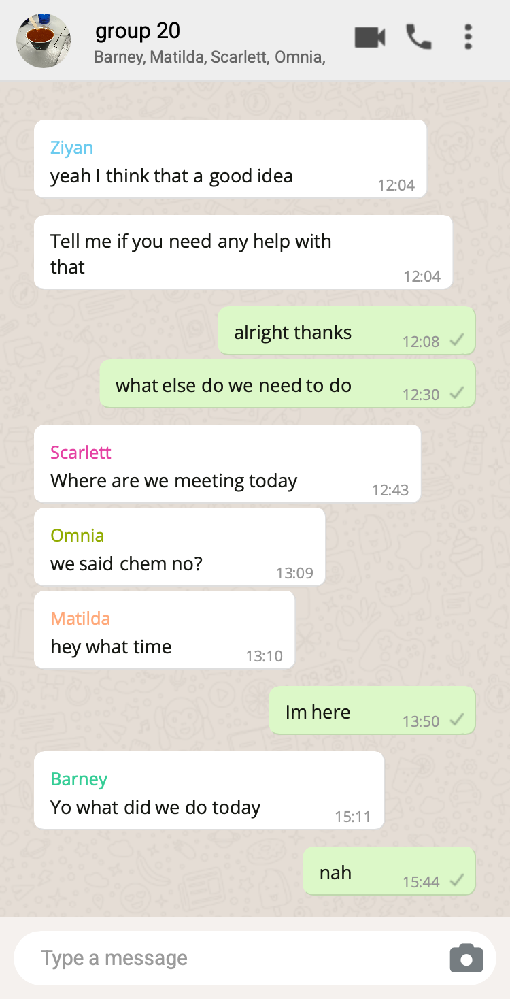

# 2025-group-20
2025 COMSM0166 group 20

## Your Game

Link to your game [PLAY HERE](https://uob-comsm0166.github.io/2025-group-20/)
git 

Your game lives in the [/docs](/docs) folder, and is published using Github pages to the link above.

Include a demo video of your game here (you don't have to wait until the end, you can insert a work in progress video)

## Your Group

- Omnia Ali, dc24201@bristol.ac.uk
- May Daoud, zy21368@bristol.ac.uk
- Barney Evershed, b.evershed.2021@bristol.ac.uk
- Scarlett Hurford, cy21903@bristol.ac.uk
- Matilda Stokes, jl21579@bristol.ac.uk
- Ziyan Zhao, rw24449@bristol.ac.uk

# Project Report

# Introduction

- 5% ~250 words 
- Describe your game, what is based on, what makes it novel?

- Smoothie Operator first came to inception as an accessible, lighthearted desktop or PC game. Simple to play, hard to get the hang of, creating a delicate balance, that appeals to both newer, more relaxed players, and the more eager, ambitious players. In essence, we wanted to capture the chaos and thrill, through the act of slicing fruit, taking inspiration from the popular tablet game "Fruit Ninja".

- Game Concept:
Fruit Ninja with a twist! Players take on the role of "knife" or "smoothie man" or "blender" (I don't really know if the player has a role sorry I just feel like those work thematically). Their task? To churn out Smoothie Recipes with precision and speed (I suppose it's not really speed but I just thought that would sound good). As they progress through the game, the fruits gets faster, the bombs get bigger (I know they don't yet but it's nice alliteration), the recipes get more bonkers and the pressue cranks up.
The "recipe system" (or the blender queue system as I like to call it), is specially designed to optimise players engagement, and the "recipe book" on hard mode gives the more advanced players a challenge. 

- Demographic and difficulty/accessibility:
We took a "the more the merrier" approach to our game demographic. The idea was to attract casual gamers, while also appealing to those looking for a challenge (more on this later, specifically when talking about our difficulty levels system). Similar to our inspiration Fruit Ninja, we wanted a "Pick up and play" or, with the tablet to desktop transition considered, the more accurately dubbed "Click on a play" design. It's an inviting, convenenient format 
Simplicity - one mouse or trackpad control
Playing sessions should be compact, digestible, but replayable 
 
- USPs (Unique Selling Point - what makes our game different?):
Fruit Ninja - with a twist! Specific slicing patterns delegated to specific fruits, as well as specific "recipes" you have to follow, adds a memory/skill-mastering aspect to the game that encourages a more engaging gameplay. 
Technologies and technological difficulties

- Player Experience (the learning curve, engagement over time etc.) and progression:
Instant gratification and satisfaction(how satisfying it is when you slice a fruit i.e. animations, graphics and sound)
Player immersion - No timer, immersive visuals etc.

- Summary of the overall vision 

# Requirements (Ziyan)

## Ideation Processing

  In the early stage of ideation process, we used both 
  <a href="https://miro.com/app/board/uXjVLtyUR80=/Miro" target="_blank">Miro</a>
  (Figure 2) and 
  <a href="https://uob-my.sharepoint.com/:w:/r/personal/zy21368_bristol_ac_uk/_layouts/15/Doc.aspx?sourcedoc=%7B16215be5-ecc8-4461-980c-cd596f6d788d%7D&action=edit&wdPid=4e6e8707"target="_blank">Google Docs</a>
   for brainstorming. We explore several ideas for this game: 

   
  <b>Figure 2. </b> <i>Brainstorming on Miro</i>

<ol>
  <li>
    <b>University Life Simulation</b> 
    Inspired by the narrative-driven gameplay of <i>Papers, Please</i>, this concept focuses on simulating student life at the University of Bristol.
  </li>
  <li>
    <b>Fashion-combat Game</b> 
    Combines fast-paced action gameplay with dress-up, drawing influence from <i>Cowgirl Crusade</i> and <i>Dress to Impress</i>.
  </li>
  <li>
    <b>Fruit-Ninja with Recipes</b> 
    A gameplay concept adapted from <i>Fruit Ninja</i> and <i>Overcooked</i>, where players use slicing techniques to prepare ingredients and complete recipe-based objectives.
  </li>
</ol>

At first, we considered developing a simulation game while integrating a two-player combat mode, thereby creating an engaging and multifaceted gameplay experience. However, following the second workshop on P5.js, we conducted a feasibility study to assess the project's scope and the technical requirements of implementing these functionalities using JavaScript. After breaking down the game into smaller sections, we concluded that the original simulation concept was slightly ambitious. The complexity involved in managing multiple intricate functionalities was identified as a significant challenge, which led us to reassess our game.

Eventually, we took a vote and decide on the third idea —an adaptation of <i>Fruit Ninja</i>—due to its manageable scale and strong emphasis on engaging gameplay mechanics. The twist to our game involves following a specific order of the recipe, where each type of fruit requires distinct slicing technique.

   
  <b>Figure 3. </b> <i>Fruit Ninja</i>

   
  <b>Figure 4. </b> <i>Overcooked</i>

## Early Design Phase
During the third workshop, we designed a Paper Prototype to refine and expand our ideas. This approach translates the complex yet abstract concepts into sets of tangible functionalities. By physically moving around the paper props, we gained further insights on visual design, controls, and optimal user interactions. This helped us establish a clear, scalable structure, making the project less daunting for the team.

   
  <b>Figure 5. </b> <i>Paper Prototype</i>

We also considered incorporating memory-based gameplay elements, wherein players would briefly see a recipe displayed with fruit icons and then need to recall it during gameplay. As levels progressed, the complexity and number of fruits would increase, challenging the player's memory further. However, in the Game Testing Activity, feedback from other teams indicated this approach demanded excessive cognitive effort, as players would need to simultaneously remember recipes and master fruit-specific slicing techniques. We took this feedback on board and decided to keep the recipes visible on-screen to improve the playability of our game. 

## Identifying Stakeholders
We first developed an Onion Model to identify key stakeholders to help us understand the different perspectives that influence game design, including players, developers, and testers. We then sought feedback during the prototype demonstrations, asking individuals to evaluate the game both as stakeholders and as players. Their insights provided input on how to refine our functional requirements.

   
  <b>Figure 5. </b> <i>Onion Model of Smoothie Operator</i>

Although our project is primarily designed in an university setting, the Onion Model underscores the capacity of successful systems to shape broader social behaviors by providing engaging gameplay experiences tailored to relevant communities.

<h2>Functional Requirements</h2>

Our group then approached defining requirements by focusing on how to make the game mechanics as intuitive and accessible as possible. We agreed that a successful game should allow players to grasp the core mechanics on their first attempt, ensuring an engaging and enjoyable experience. We used a Use-Case Diagram as guidance for what to include as a functional requirement.

<h3>1. User Interface</h3>

<ul>
  <li>The player must have access to a main menu where they can:
    <ul>
      <li>Adjust settings (audio, controls, graphics, etc.).</li>
      <li>View tutorials explaining game mechanics.</li>
      <li>Access information about the game, including lore and objectives.</li>
      <li>See their current score and highest score.</li>
    </ul>
  </li>
  <li>The player must have an option to start the game from the main menu.</li>
  <li>The player must have an option to quit the game at any point.</li>
  <li>The game must have a pause menu, allowing the player to:
    <ul>
      <li>Resume gameplay.</li>
      <li>Quit and return to the main menu.</li>
    </ul>
  </li>
  <li>The game must display a score counter and player’s lives.</li>
  <li>The game must display the game’s outcome:
    <ul>
      <li>If the player loses, a <strong>Game Over</strong> screen is displayed with the score they achieved.</li>
      <li>After losing, the system must return the player to the main menu.</li>
    </ul>
  </li>
</ul>

<h3>2. Controls</h3>

<ul>
  <li>The player uses the mouse cursor to cut the fruit/vegetables.</li>
  <li>The player navigates through the menu using the mouse.</li>
</ul>

<h3>3. Core Game Mechanics</h3>

<ul>
  <li>Fruit/vegetables are thrown up onto the screen and then fall according to gravity.</li>
  <li>The player must cut the correct fruit for the recipe displayed on the screen.</li>
  <li>For certain fruits, they must slice them in the correct pattern.</li>
  <li>If the player cuts the correct fruit in the wrong way or cuts the wrong fruit, they lose a life.</li>
  <li>If the player cuts a bomb, they lose the game and must restart.</li>
  <li>If they lose all their lives, they lose the game and must restart.</li>
</ul>

   
  <b>Figure 6. </b> <i>Use Case Diagram</i>

<h2>User Stories</h2>

To further refine the user experience, we translated these functional requirements into user stories to reflect real-life players' motivations. By prioritising features using the <strong>MoSCoW method</strong>, we ensure that essential gameplay elements are implemented first while leaving room for potential enhancements to the game.

<table>
        <thead>
            <tr>
                <th>Initiatives</th>
                <th>Epics</th>
                <th>User Stories</th>
            </tr>
        </thead>
        <tbody>
            <tr>
                <td>Simple Gameplay and Clarity</td>
                <td>
                    <ul>
                        <li>Simple mouse movements</li>
                        <li>Clear visual design and self-explanatory mechanics</li>
                    </ul>
                </td>
                <td>
                    <ul>
                        <li>As a busy player with daily commitments, I want a game that is easily accessible and simple to follow, so I can play in brief sessions without feeling overwhelmed.</li>
                        <li>As a casual player, I want a game with straightforward and intuitive gameplay that I can pick up quickly without a time-consuming learning curve.</li>
                    </ul>
                </td>
            </tr>
            <tr>
                <td>Variety of Gameplay</td>
                <td>
                    <ul>
                        <li>Various fruits</li>
                        <li>Various recipes</li>
                        <li>Various slicing patterns</li>
                    </ul>
                </td>
                <td>
                    <ul>
                        <li>As a player, I want a variety of fruits and features that introduce fresh experiences in each gameplay session.</li>
                        <li>As a long-term gamer, I want a game that never ends, so that I can play the game for longer.</li>
                    </ul>
                </td>
            </tr>
            <tr>
                <td>Progression of Difficulty</td>
                <td>
                    <ul>
                        <li>As game goes on for longer recipes get more complex</li>
                        <li>As game goes on slicing patterns get more complex</li>
                    </ul>
                </td>
                <td>
                    <ul>
                        <li>As someone who likes to be challenged, I want to experience more challenge as time goes on, thereby feeling a sense of achievement through overcoming difficulty.</li>
                    </ul>
                </td>
            </tr>
            <tr>
                <td>Sense of Achievement</td>
                <td>
                    <ul>
                        <li>Player gains points for slicing the correct fruit</li>
                        <li>Player gains points for completing a recipe</li>
                        <li>Player has their high score kept track of</li>
                        <li>Player loses lives if they do something wrong</li>
                    </ul>
                </td>
                <td>
                    <ul>
                        <li>As a long-term gamer, I want a game that has my high score, so that I can have a sense of achievement over time.</li>
                        <li>As an easily bored gamer, I want to have an element of danger in the game, so that I am kept on my toes and stay engaged.</li>
                    </ul>
                </td>
            </tr>
        </tbody>
    </table>

<h3>User Stories – Prioritized using MoSCoW and Value vs Effort</h3>
<strong>Must Have (High Value, Low Effort):</strong> 
<ul>
  <li>As a busy player with daily commitments, I want a game that is easily accessible and simple to follow, so I can play in brief sessions without feeling overwhelmed.</li>
  <li>As a casual player, I want a game with a straightforward and intuitive gameplay that I can pick up quicky without a time-consuming learning curve.</li>
</ul>
<strong>Should Have (High Value, High Effort):</strong> 
<ul>
  <li>As a player, I want a variety of fruits and features that introduce fresh experiences in each gameplay session.</li>
  <li>As a long-term gamer, I want a game that never ends, so that I can play the game for longer.</li>
  <li>As someone who likes to be challenged, I want to experience more challenge as time goes on, thereby feeling a sense of achievement through overcoming difficulty.</li>
  <li>As an easily bored gamer, I want to have an element of danger in the game, so that I am kept on my toes and stay engaged.</li>
</ul>
<strong>Could Have (Low Value, Low Effort):</strong> 
<ul>
  <li>As a long-term gamer, I want a game that has my high score, so that I can have a sense of achievement over time.</li>
</ul>

## Use Case Specification
### Single Player Mode

<Strong>Basic Flow</Strong>

| **Step** | **Easy Mode**                                                                                      | **Hard Mode**                                                                                           |
|---------:|----------------------------------------------------------------------------------------------------|----------------------------------------------------------------------------------------------------------|
| 1        | Player launches the game and selects Easy mode.                                                    | Player launches the game and selects Hard mode.                                                          |
| 2        | Recipe icons appear at the top of the screen.                                                      | Recipe icons appear at the top + slicing methods found in recipe book (bottom-right corner).            |
| 3        | Fruits appear and can be sliced freely using a mouse.                                                            | Fruits appear and must be sliced in the correct direction/method using a mouse.                                       |
| 4        | Slice any correct fruit: +10 points.                                                               | Slice correct fruit **with correct method**: +10 points.                                                 |
| 5        | Complete a recipe (all fruits in the recipe are sliced): +20 bonus points.                                     | Complete a recipe with correct slices: +20 bonus points.                                                 |
                                

<Strong>Alternative Flow</Strong>

| **Scenario**              | **Easy Mode**                                                                 | **Hard Mode**                                                                 |
|---------------------------|-------------------------------------------------------------------------------|-------------------------------------------------------------------------------|
| Wrong fruit sliced        | -1 heart. No effect on score.                                                 | -1 heart. No effect on score.                                           |
| Sliced dragon fruit       | Gain 1 heart if under 3. No effect if already at 3.                           | Same as Easy.                                                                |
| Sliced bomb               | Instant game over.                                                            | Instant game over.                                                           |
| Fruit sliced in incorrect method  | Not applicable.                                                               | -1 heart. No score.                                                          |

### Two Player Mode

<Strong>Basic Flow</Strong>

| **Step** | **Easy Mode**                                                                                                 | **Hard Mode**                                                                                                  |
|---------:|---------------------------------------------------------------------------------------------------------------|-----------------------------------------------------------------------------------------------------------------|
| 1        | Player 1 selects Easy + Two Player mode.                                                                      | Player 1 selects Hard + Two Player mode.                                                                       |
| 2        | Player 1 slices fruits using the mouse.                                                                       | Player 1 slices fruits using correct direction/method.                                                         |
| 3        | Player 2 moves basket using ⬅️ and ➡️ arrow keys to catch sliced fruit.                                        | Same as Easy mode.                                                                                             |
| 4        | Correct sliced fruit caught: +10 points.                                                                      | Correctly sliced **and** caught fruit: +10 points.                                                             |
| 5        | Recipe completion: +20 bonus points.                                                                          | Same, only if all fruits sliced correctly and caught.                                                          |

<Strong>Alternative Flow</Strong>

| **Scenario**              | **Easy Mode**                                                                 | **Hard Mode**                                                                 |
|---------------------------|-------------------------------------------------------------------------------|-------------------------------------------------------------------------------|
| Fruit missed by basket    | No points awarded.                                                           | No points awarded.                                                           |
| Wrong fruit sliced        | -1 heart.                                                                    | -1 heart.                                         |
| Sliced dragon fruit       | Gain 1 heart if under 3. No effect if already at 3.                          | Same as Easy.                                                                |
| Bomb sliced               | Instant game over for both players.                                          | Instant game over for both players.                                          |
| Incorrect slicing method  | Not applicable.                                                              | No score. -1 heart.                                                          |

# Design (Barney)

- 15% ~750 words 
- System architecture. Class diagrams, behavioural diagrams.

Our design elements had a focus on maintability and Object-Oriented Principles, in order to create a robust foundation for the game. 

- System Architecture
- This section should include our User Interface (How the user interacts with the game both visually and gesturally - ie. the mouse or trackpad sliding to simulate the slicing of the fruit), the Game Logic (the fruit generation, the mechanics behind the slicing patterns, the scoring, and the registering of incorrect slicing adnd slicing bombs) and the Data Management (Persistently tracking game state and player statistics) - let me know if I've missed anything!
- This displays a modular approach to seperating the code, which instigates efficient testing and feature addition.

- Object-Oriented Design 
- Object-Oriented Design should display clarity and flexibility: Encapsulation, Abstraction, Inheritance, Polymorphism, Composition)

- Class Diagrams
- Explanation of our different classes, their different roles and relationships in accordance with the game and Object-Oriented Principles
- So far looking at the code we have the: Fruit Class, Life Icons Class, Point System Class, Slice Pattern Class, Smoothie Recipe Class
- These classes establish the relationships and associations clearly so the interactions within code are cohesive and gameplay retains data integrity

- Behavioural Diagrams
- We need to include sequence diagrams here like in the pac-man slides (demonstrate the dynamics of the gameplay) I don't want to use this but I've made a simplified one below to show you what it could look like
Player → Cursor: slice action cursorEffect()
Cursor → Fruit: isSliced() (in SlicePattern class)
Fruit → Fruit: isHit() (in HitBox class)
Fruit → Game: correctCut || recipeComplete() (in PointSystem class)
Game → Game (only if the highest score is reached): updateHighestScore(gameScore) (in HighestPointDisplay class)
Game → UI: gameScreen() (should update the display as necessary)

- Design Decisions and Subsquent Justification
- In designing our game we decided to use p5.js - it is easy to learn and easy to use, with good HTML/CSS/JAVASCRIPT integration as well was being really adaptable and easy to use in any modern browser. 

# Implementation (Omnia)

- 15% ~750 words

- Describe implementation of your game, in particular highlighting the three areas of challenge in developing your game. 

# Evaluation (Matilda)

## Abstract

This section presents the HCI evaluations of Smoothie Operator, with a particular focus on assessing balanced usability, cognitive load, and player engagement. To assess the game's key issues early in the design process, we employed a mixed-methods approach - combining qualitative feedback from Think Aloud evaluations with quantitative data collected using the NASA Task Load Index (TLX). Evaluations were conducted with a range of participants to encapsulate a comprehensive picture of potential user behaviours and perceptions. The primary objectives were to identify the usability key issues and measure player workload and demand across gameplay tasks to inform iterative design improvements. Results from the evaluations provided clear and direct feedback on the game's task flow and cognitive demands, leading to straightforward problem-solving to gameplay.

## Qualitative: Think Aloud

To evaluate the usability and HCI design of Smoothie Operator, we employed the Think Aloud (TA) protocol—an established method that provides real-time insights into user behaviour and experience (Nielsen, 1993). This approach was selected over Heuristic Evaluation for several reasons: the dynamic nature of the gameplay—requiring rapid mouse-based gestures and immediate feedback—demanded direct observation of users in context. Heuristic methods are less effective in capturing real-time breakdowns in game interaction, particularly when evaluating unconventional input modalities. TA enables the collection of instantaneous verbal data from participants as they engage with the game. This revealed four prominent areas for improvement: confusion around input mapping, varied responses to the visual feedback system, the learning curve associated with recipe memorisation, and the overall emotional experience. The richness of these observations, particularly in relation to control fluency and gameplay clarity, significantly informed subsequent design iterations. Participant commentary was analysed using thematic coding and categorised to identify patterns of friction, satisfaction, and emergent player strategies (see Table X). 

Table X: Raw Think Aloud (TA) feedback
| Theme           | Positive                                                                                                                                 | Negative                                                                                                                            |
|----------------|------------------------------------------------------------------------------------------------------------------------------------------|-------------------------------------------------------------------------------------------------------------------------------------|
| Controls        | - The click control is very satisfying - The `cursorEffect` provides good user feedback                                              | - Touchpad is inelegant - The `mousepressed` function bugs after hearts lost - The `mousepressed` for slicing could be redundant |
| Display         | - Good fruit sizes - Fruit slice visuals are very rewarding                                                                          | - Recipe aspect and order is unclear - `cursorEffect` does not remain long enough - Some fruits are generated stuck together   |
| Learning Curve  | *(None listed)*                                                                                                                         | - Initial difficulty remembering rules - Initial difficulty remembering slice patterns - Once slice patterns are internalised, they're too easy to remember |

### Controls 
Feedback regarding the game’s controls was fairly consistent. There was a general consensus that adapting a game typically played on a touchscreen device (such as an iPad or phone) to a laptop or PC using a mouse or trackpad introduced a degree of disjointedness to the user experience. Our user tests were structured so that roughly a third of participants played using a mouse, a third with a trackpad, and a third tried both sequentially. The overall consensus was that using a mouse provided a more fluid and enjoyable gameplay experience.

A minor bug was encountered — labelled in our test documentation as "the mousePressed function bugs after hearts lost" — but this was resolved early in development.

One tester suggested that the "click and drag" mechanic for slicing might be redundant, and that gameplay might be smoother if users didn’t need to press down at all. While we carefully considered this feedback, we ultimately chose not to act on it for the following reasons:

1. The blueberry’s "slice pattern" requires a single-click input, which would become unworkable without click detection.
2. In easy mode, testers highlighted the satisfying, rapid clicking mechanic as a key positive feature.
3. Removing the click would reduce user control, increasing the likelihood of accidental slices — especially problematic when users may be trying to pause the game or consult the recipe book.

### Display
NEED TO ACTUALLY FIX SOME THINGS IN THE GAME - 1. CURSOREFFECT DOES NOT REMAIN FOR LONG ENOUGH 2. FRUIT GENERATED STUCK TOGETHER

### Learning Curve
Early user feedback regarding the game's initial difficulty was flagged: at this stage in the development several core features hadn't been implemented. Users found the games objectives and rules were initially unclear and many disliked the reliance on memory; having to remember specific slice patterns was tedious and created a slow, tedious gameplay. 

To address this, we implemented two features to our gameplay:

1. The recipe book: In hard mode, we introduced an in-game recipe book, that displays slice patterns for fruit. This allowed the user to easily refer to it during gameplay, eradicating any clunky, stop-and-start flow from having to memorise them.

*Figure 1: Demo of the interactive recipe book feature.*

2. Tutorial Mode: We also added a tutorial accessible directing from the start screen. This faciliatated users to practise before gameplay. The player could internalise the slicing mechanics, and learn other essential gamplay features, such as:
 - Avoiding the bomb
 - The dragonfruit +1 life benefit
 - The importance of slicing the fruit in the correct recipe order

*Figure 2: Clear, informative dragonfruit explanation feature in tutorial mode.*

## Quantitative: NASA TLX
One of our primary goals was to create a game that was accessible to both casual players and highly-skilled users. As a result we devised two levels of difficulty within our game. We wanted a noticable increase in difficulty between the modes (this has been proven to increase player enjoyment from previous studies (Alexander et al., 2013)), while having frustration levels remain relatively unchanged. In Easy Mode, the user still needed to slice the fruit in the correct recipe order, but the slice patterns and the bombs were scrapped. In Hard Mode, the bombs and the slice patterns were re-introduced. We collected a data using the NASA Task Load Index (TLX) from a group of diverse age ranges, and with differing experience in playing video games. We chose the NASA TLX as it's been shown to be highly reliable for assessing game difficulty (Hart & Staveland, 1988; Ramkumar et al., 2016; Seyderhelm & Blackmore, 2023). We determined that using the raw TLX scores would be easier and faster to administer, and that it makes sense to opt for the easier option when studies report back mixed results for raw vs. weighted TLX scores (Hart (2006)).

*Figure 2: NASA TLX Evaluation Bar Chart Feedback.*

The bar chart above shows a notable increase in overall workload from Easy to Hard mode: an expected and desirable outcome. These results validated our game objectives- we wanted to create an engaging learning curve to interest first-time players and long-term gamers.

- The accompanying pentagraph (below) reveals more granular differences:
- A significant rise in effort and frustration
- A moderate increase in mental demand and perceived performance
- Minimal change in physical or temporal demand

These findings suggest that the added difficulty in Hard mode effectively challenged the player without overwhelming them physically or pacing-wise.

*Figure 3: NASA TLX Pentagraph demonstrating specific demand difference feedback.*

The accompanying pentagraph (above) reveals more granular differences:
- A significant increase in effort and frustration
- A moderate increase in mental demand and perceived performance
- Minimal or no change in physical or temporal demand

These findings suggest that the added difficulty in Hard mode effectively challenged the player without overwhelming them physically or pacing-wise.

# Process
Our team had a great success working together, which was the result of a variety of software development techniques and team building exercises. Effective communication was our main priority throughout the process because it allowed us to clearly allocate tasks and track progress.
## Working as a Team
As part of the Software Engineering module, our first team building exercise let us share with each other the percentage of our individual levels of commitment to the project (ours ranged from 85% to 100%). The early weeks of development honeslty reflected those levels, but we were missing a key aspect of software engineering; collaboration. Eager to start working on the project, we began implementing our own ideas and goals, displaying a lack of clear communication. These independent efforts resulted in an incomplete and difficult to understand early prototype of the game because it did not benefit from any collaborative skills. We decided to take time to reflect on our process and think of a better approach. 
## Development Tools and Techniques
Since our main goal was to increase team effort, we decided to follow an agile framework which would allow us to prioritise collaboration and enhance our individual skills. The main agile principle we followed was breaking down our project into small and manageable iterations which would encourage us to continuously deliver working software, while working at a steady and sustainable pace. To help plan our iterations, we set up a Kanban board on our Github to organise smaller tasks and track their statuses. Before each sprint, we would have an in-person meeting to discuss which of the items on our to-do column had top priority and needed to be achieved in that iteration. Once those tasks were allocated to members of the team, we would then look to see if we could allocate other tasks with less priority. To help us plan the duration of each iteration (or sprint), we would agree on a story point for each task based on its relative size which would help us estimate the effort required. At the end, work on our game was spread across 3 sprint cycles throughout the term, with most of the features being implemented during the first sprint. We used the remaining sprints to carry out refinements and enhancements. This structure allowed us to reflect on our performance and assess our workflow. 

   
  <b>Figure 1. </b> <i>Sprint breakdown for the project</i>

   
  <b>Figure 2. </b> <i>Our Kanban board</i>

The agile iterative framework is desgined to embrace change by encouraging flexibility in handling evolving product requirements. This aspect was instrumental for us when we were asked to add a new difficulty level to the game because it meant that we could adapt to this new requirement without dsrupting the overall development process by updating our Kanban board, allocating the task and reassessing our priorities. This resulted in a fast delivery of a well-tested and fully-working easy mode for our game. 
## Communication
Another agile principle we followed was face to face communication which was often oragnised by our Scrum Master, Ziyan. However, we found out that our team member's work style would benefit more from planned long sessions at the lab rather than quick daily standup meetings as suggested by the agile principle. Thus, our Scrum Master would help us plan these coding and creativity sessions on Whatsapp where we would agree on our goals. However, the infomral nature of the app proved to be tricky; one member of team reached out to the rest of us with concerns about the work not being clearly delegated. The rest of team agreed that our communication style had been too relaxed, and suggested that we move our discussions to Microsoft's Teams which is linked to our university accounts. We changed our communication style so that it would involve a clear breakdown of our meetings summarising what our goals were ahead of the meeting, what was successfully achieved and the key points for the following meeting. In addition, we found that this was a better way for document sharing and conducting voting polls. This was also a better alternative for members who were unable to attend a particular meeting in person. 

   
  <b>Figure 3. </b> <i>An example of our old communication style</i>

   
  <b>Figure 4. </b> <i>An example of our new communication style</i>

# Sustainability (Scarlett)
- 10% ~750 words
- Evidence of the impact of your game across the environment and two of the other areas:
- Environmental + 2 of the following: social, economic, technical, individual

# Conclusion

- 10% ~500 words

- Reflect on project as a whole. Lessons learned. Reflect on challenges. Future work. 

### Contribution Statement

- Provide a table of everyone's contribution, which may be used to weight individual grades. We expect that the contribution will be split evenly across team-members in most cases. Let us know as soon as possible if there are any issues with teamwork as soon as they are apparent. 

### Additional Marks

You can delete this section in your own repo, it's just here for information. in addition to the marks above, we will be marking you on the following two points:

- **Quality** of report writing, presentation, use of figures and visual material (5%) 
  - Please write in a clear concise manner suitable for an interested layperson. Write as if this repo was publicly available.

- **Documentation** of code (5%)

  - Is your repo clearly organised? 
  - Is code well commented throughout?
